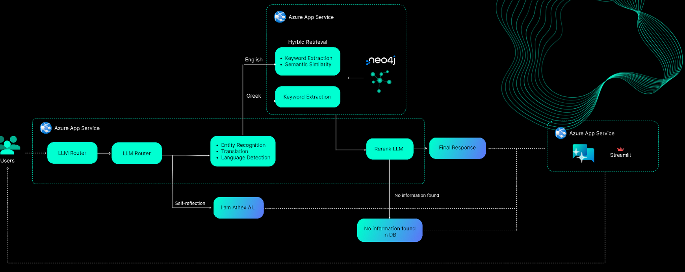

# RAGulator

A complete RAG system was developed for the AI Hackathon of AUEB Greece 2025.
The system processes complex legal PDF documents and can ingest information from scanned images, Greek/English text, figures, and tables. It provides accurate answers through a multilayered architecture. Every component (DB, API, etc.) is containerized with Docker, ensuring easy deployment.

An overview is provided below:

